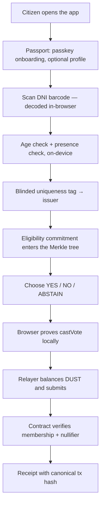

# Referéndum Cívico

**Anonymous, verifiable civic consultation on the Midnight Network.**

A citizen proves they are eligible to vote, votes once, and gets a receipt they
can check — without anyone, including us, being able to link them to their
ballot. No wallet, no browser extension, no seed phrase, no tokens.

Built for Hack Buenos Aires. This is an independent prototype, not an official
referendum.

---

## The problem

Digital civic consultation forces a choice that shouldn't have to be made.

**Centralised platforms** know who voted for what. Even when they promise not
to look, the database exists — and a database that links a citizen to a
political opinion is a permanent liability: subpoenaed, breached, sold, or
quietly used for targeting. Trust rests entirely on the operator's word.

**Public ledgers** fix auditability and break privacy. Put ballots on a chain
and you get a permanent, globally searchable record of who voted how, keyed to
a wallet address that is rarely as anonymous as people assume.

**Blockchain onboarding** excludes the people civic tech most needs to reach.
Install an extension, safeguard a seed phrase, understand gas, acquire tokens —
before casting a single vote. For a municipal consultation aimed at the general
public, this is a non-starter.

And underneath all three: **proving eligibility usually means surrendering
identity.** The normal way to prove you may vote is to hand over your ID
document to whoever is asking.

## The opportunity

Midnight can hold a ledger that is publicly auditable while the data that
produced it stays private. That makes a specific, previously awkward thing
possible: **prove membership in a set of eligible voters, and prove you have
not voted before, without revealing which member you are.**

Argentina makes this concrete. The DNI card carries a PDF417 barcode with the
holder's date of birth and document number — readable by any phone camera, with
no registry integration required. Eligibility can be established on the
citizen's own device, and only a derived, non-reversible tag ever leaves it.

Meanwhile Midnight Passport removes onboarding friction with passkey-based
identity. Combined, they allow the honest pitch: *Passport makes it usable,
Midnight makes it private, and the citizen never installs anything.*

## The solution

Three secrets that never meet.

| | Knows | Never knows |
|---|---|---|
| **Passport identity** | Your display name and profile | Your vote |
| **Voter secret** | That someone eligible voted once | Who you are |
| **Ballot choice** | Joins the public total after the close | Who cast it |

The eligibility check happens on your device. Your vote is sealed as a
cryptographic commitment. A **sponsored relayer** pays the network fee, so you
never need a wallet. The contract accepts the vote because you proved
membership in the eligible set and produced a nullifier nobody has seen —
never because of who submitted it.



### Why a relayer, and not a wallet

Midnight Passport exposes exactly two bridges to third-party apps: a profile
bridge, and a transaction bridge whose only intent kind is
`unshielded-transfer`. Its own specification is explicit — *"No contract calls,
shielded transfers, or batching."* **Passport cannot sign a Compact circuit
call.**

The alternative would be making every citizen install Lace and hold DUST, which
defeats the point. So we took the third path: the referendum contract
authorises `castVote` on **anonymous Merkle membership plus a proposal-scoped
nullifier**, and never on the submitter's identity
([`referendum.compact`](contracts/referendum/referendum.compact)). A funded
relayer can therefore pay for and submit a vote it did not author, and gains no
power over it.

## Features

**Citizen experience**
- Wallet-less voting: no extension, no seed phrase, no tokens.
- Midnight Passport onboarding with per-field consent.
- Real eligibility: camera scan of the DNI's PDF417 barcode, decoded on-device.
- Presence check: a randomised prompt sequence scored from frame motion.
- Spanish civic UI with a plain-language explainer of exactly what is public.
- Local participation receipts with canonical explorer links.

**Privacy and protocol**
- Private commit of YES / NO / ABSTAIN; only aggregates published at reveal.
- Historic Merkle tree for a growing eligibility registry.
- Proposal-scoped nullifiers: one person, one vote, unlinkable across
  referenda.
- Organizer-only close and finalize.
- Document data never uploaded; only a salted, per-referendum uniqueness tag
  leaves the device.
- Voter secrets held in IndexedDB under a non-extractable WebCrypto key.

**Infrastructure**
- Sponsored relayer that balances and submits on the citizen's behalf.
- Deploy and eligibility-issuance scripts for Midnight Preview.
- Origin-pinned, nonce-bound Passport bridge matching the published protocol.

## Tools

| Area | Stack |
| --- | --- |
| Smart contract | Compact 0.31.1, Compact CLI 0.5.1 |
| Chain runtime | Midnight.js 4.1, Compact Runtime 0.16, Ledger v8.1 |
| Relayer wallet | `@midnight-ntwrk/wallet-sdk-*` (facade 4.0.1) |
| Frontend | React 19, TypeScript, Vite 7 |
| Identity | Midnight Passport profile bridge (`org.midnight.passport.profile/v1`) |
| Document scan | PDF417 via native `BarcodeDetector`, ZXing fallback |
| Private state | WebCrypto AES-GCM + IndexedDB |
| Testing | Vitest, Compact simulator — 62 tests |
| Network | Midnight Preview |

## Getting started

### Requirements

Everything runs on Linux or WSL2. The browser may be on Windows; the toolchain
must not be.

- Ubuntu on WSL2, Node 22.22.0 (via `nvm` and the repo `.nvmrc`), npm 10
- Compact CLI 0.5.1 / compiler 0.31.1
- Docker, for the proof server
- For real transactions: a Preview-funded seed for the relayer

Everything is served over `http://localhost`, which both Passport passkeys and
the camera API accept. No HTTPS, tunnel, or hosting account is needed.

### Local demo — no wallet, no funds, no network

```bash
git clone https://github.com/tomasgarro/midnight-referendum-app.git ~/src/referendum
cd ~/src/referendum
nvm install && nvm use
bash scripts/setup-linux.sh
npm run dev -- --host localhost --port 4173 --strictPort
```

Open <http://localhost:4173>. You can walk the whole interface, scan a DNI (or
use the clearly-labelled demo document), and read the explainer. Local mode is
deliberately read-only: **it never fabricates a receipt.**

### Real votes on Preview

Three processes. First the proof server — it must be **published** to the host,
not merely exposed, or every proof fails with an error that looks like a wallet
fault:

```bash
docker run -d --name referendum-proof-server -p 127.0.0.1:6300:6300 \
  --restart unless-stopped midnightnetwork/proof-server \
  -- midnight-proof-server --num-workers 4
```

Then the relayer. Generate its seed yourself; `relayer/.env` is gitignored and
the seed is never logged or returned by any endpoint:

```bash
cp relayer/.env.example relayer/.env
node -e "console.log(require('crypto').randomBytes(32).toString('hex'))"   # → RELAYER_SEED
npm run relayer:address     # prints the address to fund
```

Send Preview NIGHT to that address and **register it for DUST generation**.
NIGHT alone is not enough — without DUST the relayer cannot pay for anything.

```bash
npm run deploy:preview      # deploys and writes the address into ui/.env
npm run relayer             # 127.0.0.1:8790
npm run dev -- --host localhost --port 4173 --strictPort
```

Set `VITE_APP_MODE=preview` in `ui/.env` and restart the dev server.

### Verify

```bash
npm test        # 62 tests: 3 contract simulator, 1 api, 58 ui
```

## Privacy model

**Public on-chain:** that a valid vote was cast; a nullifier preventing a
second one; the YES/NO/ABSTAIN totals after the close.

**Never leaves the device:** your name, document number and photograph; your
choice while voting is open; any link between your identity and your ballot.

**What the relayer sees:** the proven transaction — which carries the nullifier
and the sealed commitment — and your IP. It cannot read your choice, and cannot
tell which eligibility leaf you used, because membership is proved in zero
knowledge. It can refuse to submit, which is a liveness risk, not a privacy
one.

**What the proof server sees:** the witness, meaning your voter secret and your
choice. This is why it must run on your own machine.
`VITE_MIDNIGHT_PROOF_SERVER_URL` pointing at someone else's host hands them the
ballot in plaintext.

**What this does not prove:** reading a barcode proves possession of a
document's data, not that the document is genuine — that needs the chip and
RENAPER. The presence check defeats a held-up photograph; it is not a biometric
match against the document, and not proof against a prepared video replay. The
contract has not been audited.

---

## Status and what remains

Honest accounting, so a human or an AI agent can pick this up and know exactly
where the edges are.

### Working and verified

- [x] Compact commit/reveal contract; simulator covers double-vote, replay
      reveal, and organizer-only finalize.
- [x] Passport profile bridge conformant with the published protocol —
      embedded-mode handshake adoption, 180 s budget, closed-popup detection.
- [x] DNI PDF417 parsing, age check, salted uniqueness tag, presence scoring
      (34 unit tests).
- [x] Relayer runs against live Preview: syncs, and serves correct Bech32m
      addresses and keys, CORS-restricted with input validation.
- [x] Deploy and `--issue` scripts.
- [x] Local read-only mode that cannot fabricate a receipt.

### Not yet verified

- [ ] **A real `castVote` on Preview.** Everything is wired and typechecks, but
      no transaction has been submitted end to end. Blocked only on a funded
      relayer seed. This is the single most valuable next step.
- [ ] **The camera path against a physical DNI.** Parsing is unit-tested
      against synthetic payloads; live PDF417 decoding has not been run, and
      ZXing thresholds will likely need tuning. Needs a phone on
      `http://localhost:4173`.
- [ ] **Relayer balancing under load** — `/balance` and `/submit` have not been
      exercised with a real transaction.

### To build next

1. **Organizer console** — `closeVote`, `revealVote`, `finalizeVote` exist in
   the contract and executor but have no UI. Without it a referendum can be
   voted in but never counted. Start at
   [`api/src/index.ts`](api/src/index.ts) `createReferendumExecutor`.
2. **Verificá should query the indexer.** It currently only searches
   `localStorage`, so a receipt from another device cannot be checked — which
   undercuts the public-verifiability claim. See `VerifyView` in
   [`ui/src/App.tsx`](ui/src/App.tsx).
3. **Results presentation** — reveal-phase timing and a finalized-result view.
4. **Issuer service.** `--issue` is operator-run; the uniqueness tag needs a
   real endpoint that enforces one registration per document.
5. **Recovery.** A voter secret lost with browser storage is a lost vote;
   private-state export is deliberately disabled pending a design.
6. **Rarimo / Blockenfy adapters** stay disabled until a tested Midnight
   attestation verifier exists.
7. **Security review** of the contract, the relayer trust boundary, and the
   browser private-state model before this is described as production civic
   infrastructure.

See [DEVELOPMENT.md](DEVELOPMENT.md) for the working setup and
[relayer/README.md](relayer/README.md) for the relayer's trust boundary.

## License

Apache 2.0. See [LICENSE](LICENSE).
